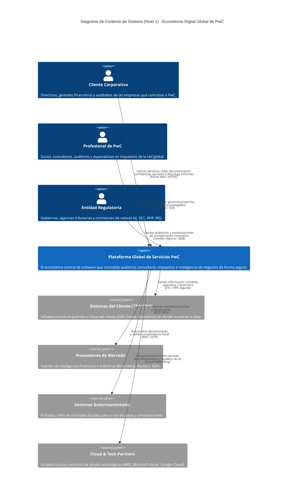

```mermaid
C4Context
    title Diagrama de Contexto de Sistema (Nivel 1) - Ecosistema Digital Global de PwC

    %% Actores / Personas
    Person(cliente, "Cliente Corporativo", "Directivos, gerentes financieros y auditados de las empresas que contratan a PwC.")
    Person(consultor, "Profesional de PwC", "Socios, consultores, auditores y especialistas en impuestos de la red global.")
    Person(regulador, "Entidad Regulatoria", "Gobiernos, agencias tributarias y comisiones de valores (ej. SEC, AFIP, IRS).")

    %% Sistema Principal
    System(pwc_system, "Plataforma Global de Servicios PwC", "El ecosistema central de software que consolida auditoría, consultoría, impuestos e inteligencia de negocios de forma segura.")

    %% Sistemas Externos
    System_Ext(erp_cliente, "Sistemas del Cliente (ERP/CRM)", "Infraestructura on-premise o cloud del cliente (SAP, Oracle, Salesforce) de donde se extrae la data.")
    System_Ext(market_data, "Proveedores de Mercado", "Fuentes de inteligencia financiera e industrial (Bloomberg, Reuters, S&P).")
    System_Ext(gov_system, "Sistemas Gubernamentales", "Portales y APIs de entidades fiscales para cruce de datos y presentaciones.")
    System_Ext(tech_partners, "Cloud & Tech Partners", "Infraestructura y servicios de aliados estratégicos (AWS, Microsoft Azure, Google Cloud).")

    %% Relaciones (con saltos de línea para evitar superposición)
    Rel_D(cliente, pwc_system, "Solicita servicios, sube documentación<br>confidencial, aprueba y descarga informes", "Portal Web / HTTPS")
    Rel_D(consultor, pwc_system, "Procesa datos masivos, gestiona proyectos,<br>colabora y genera entregables", "Intranet / SSO")
    
    %% Ponemos al regulador de costado para balancear el diagrama
    Rel_R(regulador, pwc_system, "Recibe auditorías y presentaciones<br>de cumplimiento normativo", "Canales Seguros / B2B")

    Rel_D(pwc_system, erp_cliente, "Extrae información contable,<br>operativa y financiera", "ETL / APIs Seguras")
    Rel_D(pwc_system, market_data, "Consume tendencias macroeconómicas<br>y benchmarks", "REST APIs")
    Rel_D(pwc_system, gov_system, "Automatiza declaraciones<br>y valida cumplimiento fiscal", "APIs / SFTP")
    Rel_D(pwc_system, tech_partners, "Delega procesamiento pesado,<br>almacenamiento y modelos de IA", "Cloud Networking")
```
